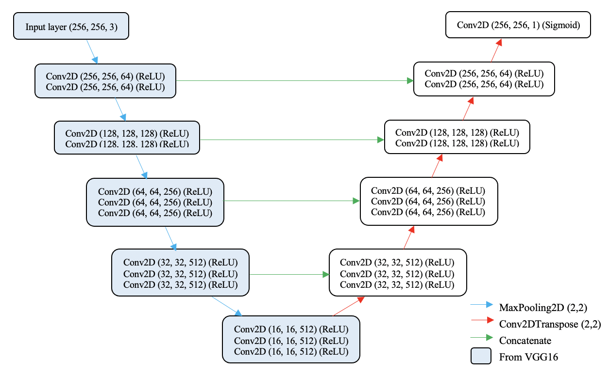
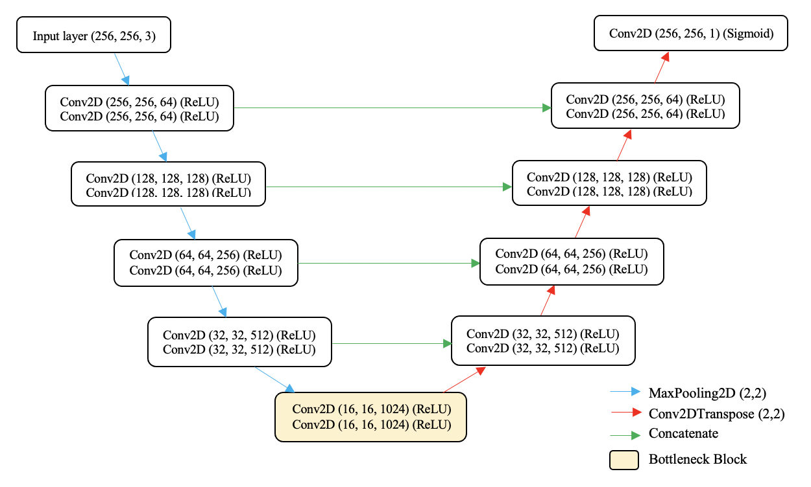

# Transfer Learning U-Net Deep Learning for Lung Ultrasound Segmentation
This study focuses on completing segmentation of the ribs from lung ultrasound images (LUS) and finding the best transfer learning technique with U-Net network structure. The paper for this study can be found here: http://arxiv.org/abs/2110.02196

Codes for our deep learning models are witten in Python and implemented with TensorFlow 2.6.0. Keras library is used on top of TensorFlow, allowing codes running seamlessly on both CPU and GPU. Keras documentation is linked here: [Keras.io](https://keras.io/) 


# Models Overview

U-Net is used as our neural network architecture framework, originated in [U-Net: Convolutional Networks for Biomedical Image Segmentation](https://lmb.informatik.uni-freiburg.de/people/ronneber/u-net/). To implement transfer learning, we designed the following two models for our LUS segmentation task, V-Unet and X-Unet, inspired by two similar research on ultrasound segmentation: [Automatic detection of lumen and media in the IVUS images using U-Net with VGG16 Encoder](https://arxiv.org/pdf/1806.07554.pdf) and [Fine-Tuning U-Net for Ultrasound Image Segmentation: Different Layers, Different Outcomes](https://ieeexplore.ieee.org/document/9162061?denied=). Dice coefficient (DICE) is used as the evaluation metric. 

## V-Unet models and versions

V-Unet (U-Net with VGG16 as the encoder and further trained on LUS) has a structure shown in the following figure. VGG16, pretrained model on ImageNet is used to replace the contracting path of U-Net as a hybrid between these structures. The whole network had 28,804,545 parameters in total.



We trained the V-Unet with different dataset sizes listed below. The `V-Unet` folder contains two version of V-Unet models, with the highest DICE of **0.8632** achieved from v1_1. 
|Version  |File                |Description                              
|--       |--------            |-----------                              
|v1_1     |`V_Unet_v1_1.ipynb` |Pretraining and fine-tuning with 400 LUS 
|v1_2     |`V_Unet_v1_2.ipynb` |Pretraining and fine-tuning with 200 LUS

There is a folder for each of the model version, containing their TL pretrained model, and 5 five FT model from 5-Fold cross validation, all in `.hdf5` format. Training logs for both TL and FT training are in `.csv` format. 

## X-Unet models and verisons 

X-Unet (U-Net pretrained on salient object dataset and fine-tuned on LUS) has a structure shown in the following figure. It is a U-Net structure built from scratch and pre-trained with XPIE dataset, a publicly availble dataset of salient objects. (See Section **XPIE Dataset** for more details.) 



We trained the X-Unet with different strategies and dataset sizes listed below. The `X-Unet` folder contains three version of V-Unet models, with the highest DICE of **0.8297** achieved from v3_3. 
|Version  |File                 |Description
|--       |--------             |-----------
|v3_3     |`X_Unet_v3_3.ipynb`  |Fine-tuning all layers with 400 LUS
|v3_2     |`X_Unet_v3_2.ipynb`  |Fine-tuning with bottleneck block frozen with 400 LUS
|v3_4     |`X_Unet_v3_4.ipynb`  |Fine-tuning all layers with 600 LUS 

There is a folder for each of the model version, containing their TL pretrained model, and 5 five FT model from 5-Fold cross validation, all in `.hdf5` format. Training logs for both TL and FT training are in `.csv` format. 

## Model Evaluation and Predictions

All model evaluations are presented in `ModelEvaluation.ipynb`, with the use of the same test dataset `Dafault_testset.csv`. Actual mask predictions of different versions of the V-Unet and X-Unet are shown in this file, with detailed comparision presented in the paper. 

## Python functions used in model training 
`DataPreprocessing.py` contains funtions called in data preparation before model training.  
`Model.py` contains functions of the V-Unet and X-Unet structure and their manipulation.  
`ValidationAndPrediction.py` contains functions functions called for plotting training histories and displaying mask predictions. 


# Lung Ultrasound Images (LUS) Data

ALL raw images and processed image dataset are stored under folder `Lung_seg_data`. 

## Raw LUS images

Raw LUS images are provided by Dr. Wei-Ning Lee, Department of Electrical and Electronic Engineering, HKU. They are in `.mat` format consisting of raw B-mode LUS images collected from a healthy volunteer (male, 26 years old) in two positions (pos2 and pos3). `LUSDataInfo.txt` contains details of the raw LUS. 

## Image pre-processing in MATLAB

Codes are under `MATLAB_preprocessing` folder.  
LUS images are pre-processed in MATLAB to remove the speckle noise (SN). A Homomorphic wavelet transform filter was used for SN reduction. Codes are modified from [Speckle Noise Rediction in Ultrasound Images](https://uk.mathworks.com/matlabcentral/fileexchange/41240-speckle-noise-reduction-in-ultrasound-images) project by Ashish Mesharm. All filtered LUS are stored in `TIFF` format. 

Aanual annotation of the ribs from LUS were done using codes under `Mask_annotation` folder. Binary masks are created and stored in `TIFF` format. 

## Processed LUS dataset used in model training

The following is a list of sub-folders under `Lung_seg_data` folder and their descriptions of all the processed and filtered images and masks dataset used in training processes. 

|Folder                   |Description
|----------               |------------
|`NEW_TIF_IMG`            |200 LUS used in all models
|`NEW_TIF_MASK`           |200 binary masks of LUS in `NEW_TIF_IMG`
|`NEW_CODES`              |Contains folders `newcode_gen_images` and `newcode_gen_masks`, which are the horizontally flipped copies from `NEW_TIF_IMG` and `NEW_TIF_MASK`, used in all models except V-Unet v1_2
|`EXTRA_IMG_TIF`          |Extra 100 LUS used in X-Unet v3_4
|`EXTRA_MASK_TIF`         |100 binary masks of LUS in `EXTRA_IMG_TIF`, used in X-Unet v3_4
|`EXTRA_IMG_TIF_FLIPPED`  |Horizontally flipped copies OF `EXTRA_IMG_TIF`, USED IN X-Unet v3_4
|`EXTRA_MASK_TIF_FLIPPED` |Horizontally flipped copies OF `EXTRA_MASK_TIF`, used in X-Unet v3_4

All datasets come into pairs (IMG and MASK) with the same indexing to indicate the correct binary mask to its corresponding image frame, in the following format: 
```
- LUS
    |
    ---- IMG
    |    |
    |    ---- img_lung_pos2_5.tif
    |    |
    |    ---- ...
    |
    ---- MASK 
         |
         ---- mask_lung_pos2_5.tif
         |
         ---- ...
```


# XPIE Dataset

XPIE dataset is a publicly available dataset containing 100,000 natural salient objects, orignally used for salent object detection research, available here: [What is and What is not a Salient Object? Learning Salient Object Detector by Ensembling Linear Exemplar Regressors](http://cvteam.net/projects/CVPR17-ELE/ELE.html). the `XPIEinfo.txt` under the `XPIE` folder contains the files information and the dataset download link.

The whole dataset is converted into grayscale for better mimic LUS images for transfer learning, which the pre-processing is finished with `XPIEpreprocessing.ipynb`. 


